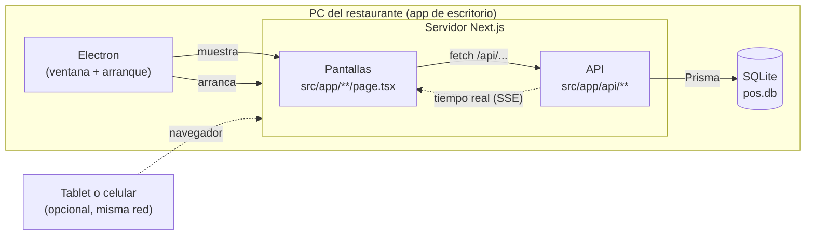

# 2. Cómo está armado

## Las piezas



| Pieza | Qué es | Dónde está |
|---|---|---|
| **Next.js** | El framework web. Sirve las **pantallas** (lo que se ve) y la **API** (lo que guarda y lee datos) desde un mismo servidor. | `src/app/` |
| **React** | Con lo que están hechas las pantallas. | `src/app/**/page.tsx`, `src/components/`, `src/hooks/` |
| **API** | Rutas que reciben y devuelven datos en JSON. Validan, revisan permisos y hablan con la base. | `src/app/api/**/route.ts` |
| **Prisma** | El "traductor" entre el código TypeScript y la base de datos. Se escribe `prisma.mesa.findMany()` en lugar de SQL. | `prisma/schema.prisma`, `src/lib/prisma.ts` |
| **SQLite** | La base de datos. Es **un solo archivo** (`dev.db` en desarrollo, `pos.db` en el restaurante). No necesita un servidor aparte, por eso funciona sin internet. | `prisma/dev.db` / carpeta de datos de la app |
| **SSE** | *Server-Sent Events*: una conexión que queda abierta para que el servidor avise cambios al instante (pedido nuevo, mesa ocupada...). | `src/app/api/events`, `src/hooks/useSSE.ts` |
| **Electron** | Envuelve todo en una aplicación de Windows: arranca el servidor y abre una ventana con la app. | `electron/` |

## Cómo viaja un dato

Ejemplo: el cocinero toca "MARCAR COMO LISTO".

1. La pantalla de Cocina hace `PATCH /api/pedidos` con `{ id, estado: "listo" }`.
2. La ruta revisa que haya **sesión** y que el **rol** pueda hacerlo (`requireAuth` en `src/lib/auth.ts`).
3. Revisa que el cambio de estado esté **permitido** (`TRANSICIONES` en `src/lib/pedidos.ts`).
4. Guarda el cambio en SQLite con Prisma, dentro de una **transacción** (todo o nada).
5. Emite los eventos `pedido:actualizado` y `mesa:actualizada` por SSE.
6. Las pantallas de Sala y Cocina que estén abiertas reciben el aviso y vuelven a pedir los datos.

## Mapa de carpetas

```
src/
  app/                 Pantallas (page.tsx) y API (api/**/route.ts) — la ruta de la carpeta es la URL
    page.tsx           Inicio (/)
    comandas/          Sala (/comandas)
    cocina/            Cocina (/cocina)
    admin/             Administración (/admin y sus secciones)
    api/               Todas las rutas de la API
  components/          Piezas de pantalla reutilizables (avisos de error, modal de ajuste de stock...)
  hooks/               Lógica de pantalla reutilizable (cargar datos, tiempo real, modales...)
  utils/               Funciones de frontend sin React (formato de pesos, HTML para imprimir...)
  lib/                 Lógica del servidor: permisos, dinero, stock, migraciones, transacciones...
  proxy.ts             Revisa la sesión antes de abrir /comandas, /cocina o /admin
  instrumentation.ts   Al arrancar el servidor, aplica las migraciones de la base
prisma/
  schema.prisma        La forma de la base de datos (tablas y campos)
  seed.ts              Datos de ejemplo para desarrollo
  seed-production.ts   Datos mínimos para la base que se entrega al cliente
electron/              La app de escritorio
scripts/               Arma el paquete del .exe y otras herramientas
e2e/                   Pruebas de punta a punta con un navegador real
src/__tests__/         Pruebas automáticas del servidor
docs/                  Documentación (esta carpeta incluida)
```

## Las tablas de la base

Están definidas en `prisma/schema.prisma`. Las principales:

| Tabla | Guarda |
|---|---|
| `Usuario` | Personal: nombre, PIN (guardado como hash), rol, si está activo |
| `Mesa` | Número, capacidad, sector (salón/barra), forma, posición en el plano, estado |
| `Categoria`, `Producto` | El menú: categorías y productos con su precio |
| `Pedido`, `ItemPedido` | Cada comanda y sus platos |
| `HistorialPedido` | Quién cambió qué en cada pedido y por qué |
| `Venta` | Cada cobro (y cada anulación, en negativo) |
| `Insumo`, `Proveedor` | Ingredientes con su stock y a quién se les compran |
| `RecetaItem` | Cuánto de cada insumo lleva un producto |
| `MovimientoStock` | Cada entrada y salida de stock, con su motivo |
| `CostoFijo` | Alquiler, sueldos y otros costos |

Siguiente: [Primeros pasos](03-primeros-pasos.md).
