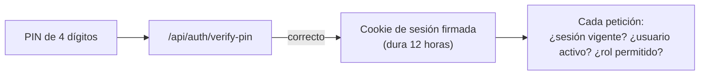
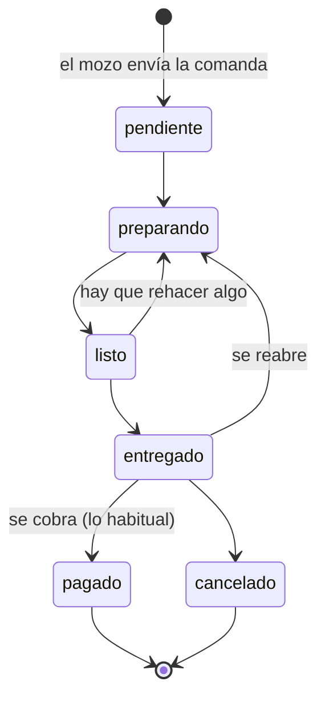

# 4. Conceptos clave

Son las reglas del negocio que el código cuida. Si vas a tocar algo de esto, lee primero esta página: varias de
estas reglas existen porque antes hubo un error.

## Dinero: centavos enteros

- La base guarda **$1.250,50 como `125050`** (centavos enteros). Las computadoras redondean mal los decimales
  (`0.1 + 0.2` da `0.30000000000000004`), y en una caja eso termina en diferencias de centavos.
- La **API habla en pesos**: recibe y devuelve `1250.5`. La conversión está en `src/lib/money.ts`
  (`aCentavos`, `enPesos`).
- En pantalla, los montos se muestran **siempre** con `formatPesos` (`src/utils/dinero.ts`): `$1.500`, `$1.500,50`,
  `-$200`. No uses `toLocaleString()` suelto: el resultado depende del idioma de la PC.
- Tope por monto: $10.000.000.

## Sesión, PIN y roles

- El PIN se guarda como **hash**: ni mirando la base se puede saber cuál es.
- Al entrar se crea una **cookie de sesión firmada** que dura **12 horas**. "Firmada" significa que no se puede
  falsificar ni modificar.
- En **cada** petición el servidor vuelve a mirar en la base que el usuario siga **activo** y cuál es su **rol**.
  Si un admin desactiva a alguien, el cambio vale desde la siguiente petición.
- **Límite de intentos:** cada 10 PIN incorrectos seguidos, el ingreso se bloquea un rato; el bloqueo se duplica
  cada vez (1, 2, 4, 8 minutos...) hasta un máximo de 15.
- Si la sesión vence con una pantalla abierta, la app vuelve sola al inicio para pedir el PIN otra vez.
- Las pantallas saben quién está logueado con `useSesion()` (`src/hooks/useSesion.ts`).

**Quién puede qué** (resumen; el detalle por ruta está en `docs/auditoria/commit-03-autenticacion.md`):

| Acción | Roles |
|---|---|
| Crear pedidos y cobrar | MOZO, ADMIN |
| Cambiar el estado de un pedido, editar sus ítems, cancelarlo | COCINERO, ADMIN |
| Anular una venta, editar el plano de mesas, todo lo de Administración | ADMIN |

## Estados de un pedido

- Los pasos de cocina (pendiente → preparando → listo → entregado) están en **`TRANSICIONES`**
  (`src/lib/pedidos.ts`). Cualquier otro cambio de estado responde `400`.
- **Cobrar** y **cancelar** se pueden hacer desde **cualquier estado no final** (el diagrama muestra el caso
  habitual, desde entregado). Cobrar va por `/api/checkout/pay` y cancelar por `/api/pedidos/{id}/cancel`, con
  motivo.
- **`pagado` y `cancelado` son finales:** un pedido cobrado no se reabre. Si el cobro estuvo mal, se **anula la
  venta** en Caja.
- Si dos personas cambian el mismo pedido a la vez, la segunda recibe `409` ("cambió mientras tanto") y la
  pantalla recarga.

## Estados de una mesa

| Estado | Cuándo |
|---|---|
| `libre` | Sin pedidos sin cobrar: se puede sentar gente |
| `ocupada` | Hay un pedido pendiente, en preparación o ya entregado pero sin cobrar |
| `esperando` | Un pedido está **listo** para llevar a la mesa |

Una mesa solo vuelve a `libre` cuando se **cobra** o se **cancela** su pedido. Un pedido **entregado y sin cobrar**
la mantiene `ocupada` (la comida ya se sirvió, pero el cliente sigue en la mesa), y por eso tampoco se puede marcar
libre a mano ni eliminar: la API responde `400`. La lista de estados que ocupan una mesa es `PEDIDOS_QUE_OCUPAN_MESA`
(`src/lib/mesas.ts`).

## Cobro y anulación

- **Cobrar** (`POST /api/checkout/pay`) cierra el pedido como `pagado`, registra la `Venta`, genera los tickets,
  descuenta el stock y libera la mesa. Todo junto: si algo falla, no se guarda nada.
- **Cobrar dos veces el mismo pedido no cobra dos veces:** si se corta la red y se reintenta, el servidor devuelve
  la misma venta con `reintento: true`. A esto se le llama ser **idempotente**.
- **Anular** (`POST /api/ventas/{id}/anular`, solo ADMIN) no borra la venta: crea un **asiento de anulación** con
  el total en negativo y su motivo, y devuelve el stock. En Caja se ve en rojo, y la venta original tachada. Así la
  historia de la caja nunca se pierde.

## Stock e inventario

- Cada **insumo** (carne, aceite, cerveza...) tiene su stock en su unidad (kg, litro, unidad, paquete).
- Cada **producto** puede tener una **receta**: cuánto de cada insumo lleva una unidad (ej.: una hamburguesa lleva
  0,2 kg de carne). Se carga en Menú → Receta.
- El stock se **descuenta al cobrar** y se **devuelve al anular**. Productos sin receta se venden igual, sin mover
  stock.
- Los **ajustes manuales** se hacen con "Ajustar": se **suma o resta** una cantidad con un **motivo**
  (`POST /api/inventario/ajuste`). Nunca se escribe el valor final, porque eso pisaría las ventas hechas mientras
  tanto.
- **Cada movimiento queda registrado** en `MovimientoStock`: venta, anulación o ajuste, con quién y por qué.
- El stock puede quedar **negativo** (se vendió antes de registrar una compra); Inventario lo marca como "Bajo".

## Tiempo real

- El servidor mantiene una conexión **SSE** abierta con cada pantalla (`/api/events`) y avisa:
  `pedido:nuevo`, `pedido:actualizado` y `mesa:actualizada`.
- Las pantallas no confían en el contenido del aviso: al recibirlo **vuelven a pedir los datos** a la API.
- Si la conexión se corta, se reconecta sola y vuelve a pedir todo, porque los avisos de ese rato se perdieron.
- Si la sesión vence, el servidor manda `sesion-vencida` y la pantalla vuelve al inicio.

## Escrituras en la base: de a una

SQLite admite **un solo escritor a la vez**. Si cinco mozos cobran al mismo tiempo y cada uno intenta escribir por
su cuenta, cuatro reciben error. Por eso **toda** escritura pasa por `transaccion()` o `escritura()`
(`src/lib/transaccion.ts`), que las pone en fila. No uses `prisma.$transaction` directo en una ruta.

## Migraciones automáticas

Cuando cambia la forma de la base (una tabla o un campo nuevo), la base del restaurante tiene que actualizarse sin
que nadie corra comandos. Al arrancar, el servidor aplica los **pasos pendientes** de `src/lib/migraciones.ts`
(desde `src/instrumentation.ts`). Un cambio de esquema nuevo siempre agrega un paso al final de esa lista, con su
prueba.

Siguiente: [Pantallas](05-pantallas.md).
