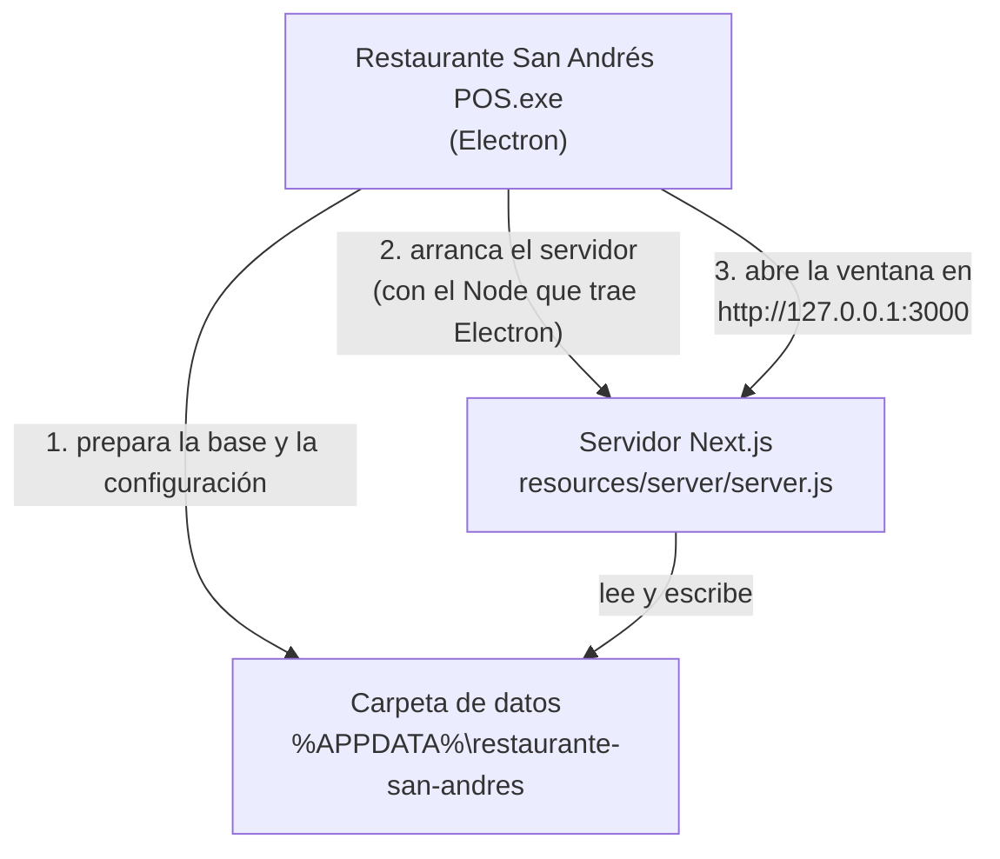

# 7. La app de escritorio (.exe)

## Qué recibe el cliente

Un instalador: `release/Restaurante San Andrés POS Setup <versión>.exe` (unos 160 MB). Lo instala con doble clic y
le queda un acceso directo en el escritorio. No necesita Node.js, terminal ni internet.

> Windows puede mostrar el aviso de **SmartScreen** porque el instalador no tiene firma digital: "Más información"
> → "Ejecutar de todas formas".

## Cómo funciona por dentro



1. **Prepara los datos.** La primera vez copia una base vacía (`template.db`, con usuarios, mesas y categorías
   iniciales) como `pos.db`. Las siguientes veces hace una **copia de seguridad** de `pos.db` antes de arrancar.
2. **Arranca el servidor** Next.js en un proceso aparte, usando el Node que ya viene dentro de Electron.
3. **Abre la ventana** cuando el servidor responde. Mientras tanto muestra "Iniciando sistema…".
4. Al arrancar, el servidor **aplica las migraciones** pendientes: si la nueva versión cambió la base, se actualiza
   sola.

El código está en `electron/main.js`.

## La carpeta de datos del restaurante

`%APPDATA%\restaurante-san-andres\` (en el Explorador de Windows, pegar esa ruta en la barra de direcciones):

| Archivo o carpeta | Qué es |
|---|---|
| `pos.db` | **La base de datos real.** Pedidos, ventas, menú, todo. |
| `backups\` | Una copia de `pos.db` por cada arranque; se guardan las últimas 15 |
| `config.json` | Configuración (ver abajo) |
| `session.key` | Clave para firmar las sesiones; se crea sola, una por instalación |
| `uploads\` | Fotos de productos subidas |
| `logs\main.log`, `logs\server.log` | Registros: lo primero que hay que mirar si algo falla |

Esta carpeta **no se borra** al desinstalar ni al instalar una versión nueva: los datos se conservan.

**Respaldo manual:** cerrar la app y copiar `pos.db` (y `session.key` y `config.json`) a un pendrive.

## `config.json`

Se crea la primera vez. Para cambiarlo: cerrar la app, editar el archivo y volver a abrirla.

```json
{
  "port": 3000,
  "lan": false,
  "negocio": {
    "nombre": "Restaurante San Andrés",
    "cuit": "30-12345678-9",
    "direccion": "Av. San Martín 1234, San Andrés"
  }
}
```

| Campo | Para qué |
|---|---|
| `port` | Puerto del servidor. Cambiarlo solo si otro programa usa el 3000. |
| `lan` | `true` para que **tablets o celulares de la misma red** entren a `http://IP-de-esta-PC:3000`. Windows pregunta por el firewall la primera vez. |
| `negocio` | Lo que se imprime en los tickets. **Los valores por defecto son de ejemplo:** hay que poner los reales. |

## Generar el instalador

```bash
npm run dist:win
```

Hace tres cosas:

1. `npm run build`: compila la app en modo *standalone* (un servidor autónomo con solo lo necesario).
2. `npm run desktop:prepare` (`scripts/prepare-desktop.mjs`): arma `desktop-build/` con el servidor, los archivos
   estáticos, el motor de Prisma para Windows y la base `template.db` (esquema actual + `prisma/seed-production.ts`).
3. `electron-builder`: empaqueta todo. El paso `electron/after-pack.js` copia el servidor al paquete y **corta el
   build si falta algo**, para no entregar un `.exe` roto.

Para probar sin generar el instalador: `npm run desktop:test`.

> **Ojo al probar el `.exe` en tu PC:** usa **tu** carpeta de datos real (`%APPDATA%\restaurante-san-andres`). Haz un
> respaldo de `pos.db`, `config.json` y `session.key` antes, y restáuralo después.

## Por qué está hecho así

Las primeras versiones fallaban ("Could not find a production build", ventana en blanco o cierre sin aviso). Las
causas y sus soluciones, por si alguien vuelve a tocar el empaquetado:

| Problema | Solución |
|---|---|
| El servidor quedaba dentro de `app.asar`, donde Next.js no puede arrancar | El servidor va **fuera** del asar, en `resources/server` |
| electron-builder borraba en silencio las carpetas `node_modules` del servidor | Las copia `after-pack.js` en vez de `extraResources` |
| Turbopack dejaba accesos directos (*junctions*) a carpetas de la PC del desarrollador | `prepare-desktop.mjs` los reemplaza por copias reales |
| Las fotos se guardaban en la carpeta de instalación (sin permiso de escritura) | Se guardan en `uploads\` de la carpeta de datos |
| El paquete se incluía a sí mismo y crecía en cada build | `outputFileTracingExcludes` en `next.config.ts` |

Siguiente: [Pruebas y calidad](08-pruebas.md).
