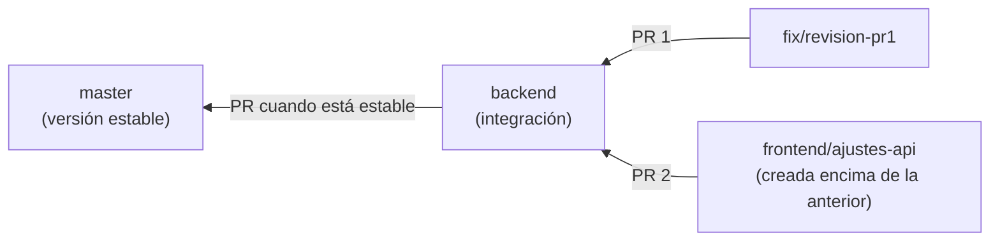

# 9. Trabajo en equipo

## Quién hace qué

Para no pisarnos, el código está dividido por carpetas (ver `CLAUDE.md`):

| Zona | Carpetas | Responsable |
|---|---|---|
| **Frontend** | páginas y layouts de `src/app` (no `api/`), `src/components`, `src/hooks`, `src/types`, `src/utils` | Agus |
| **Backend** | `src/app/api`, `src/lib`, `prisma`, `src/proxy.ts`, `electron`, `src/__tests__`, `scripts` | José |

- Cada uno toca **solo su zona**. Si necesitas algo de la otra, se pide.
- **Cambiar un contrato de la API** (lo que una ruta recibe o devuelve) **se avisa antes**: rompe la otra mitad.
- Lo que no está en ninguna zona (`docs/`, `e2e/`, `package.json`) se coordina.

## Ramas

- **`master`:** la versión estable.
- **`backend`:** donde se integra el trabajo antes de pasar a `master`.
- **Ramas de trabajo:** una por tema, con nombre que diga qué es (`frontend/contraste`, `fix/revision-pr1`,
  `chore/calidad-pruebas`). Se crean desde la última rama integrada.
- Nunca se trabaja directo sobre `master` ni `backend`.

## Pull requests (PR)

Un PR es el pedido de "mezclar mi rama en otra". En GitHub se revisa el cambio, corren las pruebas automáticas (CI) y
recién después se mezcla.

- Cuando varias ramas están **apiladas** (cada una encima de la anterior), se abren todos los PR hacia `backend` y
  se **mezclan en orden**, en la misma sesión.
- Siempre con **"Create a merge commit"**: ni *squash* ni *rebase*, para no romper la cadena.
- Un PR apilado muestra también los cambios de los anteriores hasta que esos se mezclan. Es normal.

## Commits

- Un commit por tema, con mensaje que explique **qué** y **por qué**: `fix(cocina): el "+" no sumaba la segunda vez`.
- Prefijos: `feat` (algo nuevo), `fix` (arreglo), `refactor`, `test`, `docs`, `chore` (mantenimiento).
- Del lado del backend, cada grupo de cambios tiene su documento en `docs/auditoria/` y su fila en el índice.

## Trabajar con asistentes de IA

Los dos usamos Claude Code. Para que no se mezclen las cosas:

- **Una sola sesión** edita la carpeta a la vez. Dos sesiones sobre la misma carpeta se pisan los archivos.
- Los mensajes entre asistentes se pasan **a mano** (copiar y pegar). Antes de actuar sobre un mensaje viejo,
  verificar con `git fetch` y `git log` cómo está el repositorio de verdad.
- `CLAUDE.md` tiene las convenciones que el asistente lee siempre; si cambia una regla del proyecto, va ahí.
- Las correcciones que hubo que hacer a mano se anotan en `docs/lecciones-aprendidas.md`.

Siguiente: [Problemas frecuentes](10-problemas-frecuentes.md).
